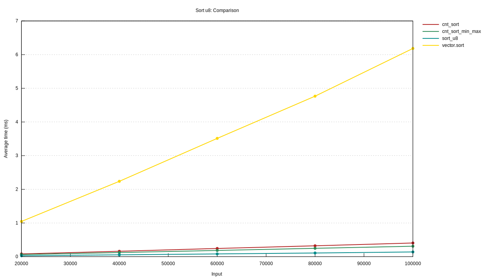
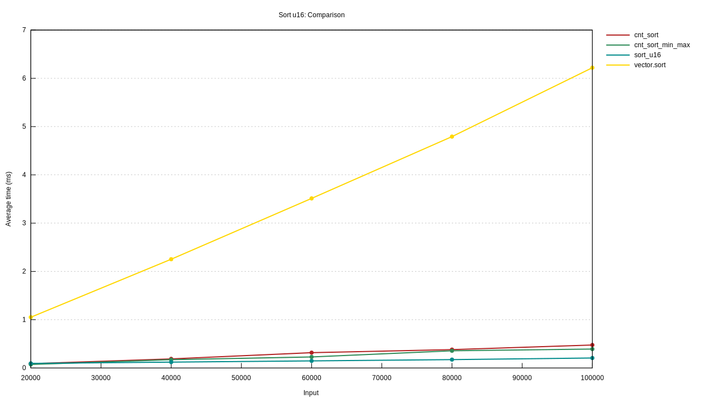

# Counting Sort

A counting sort implementation for [`DoubleEndedIterator`](https://doc.rust-lang.org/std/iter/trait.DoubleEndedIterator.html)s.

## Usage

Add dependency to your `Cargo.toml`:

```toml
[dependencies]
counting_sort = "1.0.0"
```

Works immediately "out of the box" for e.g. [`Vec`](https://doc.rust-lang.org/std/vec/struct.Vec.html)s holding integers like [`u8`](https://doc.rust-lang.org/std/primitive.u8.html), [`u16`](https://doc.rust-lang.org/std/primitive.u16.html), [`i8`](https://doc.rust-lang.org/std/primitive.i8.html), [`i16`](https://doc.rust-lang.org/std/primitive.i16.html) etc..

```rust
/*
 * Add counting sort to your source code.
 */
use counting_sort::CountingSort;

let vec = vec![2,4,1,3];

// counting sort may fail, therefore a result is returned
let sorted_vec_result = vec.iter().cnt_sort();
assert!(sorted_vec_result.is_ok());

// if successful sorted elements were copied into a Vec
assert_eq!(vec![1,2,3,4], sorted_vec_result.unwrap());
```

## Code coverage

```console
[INFO tarpaulin] Coverage Results:
|| Uncovered Lines:
|| src/lib.rs: 118
|| Tested/Total Lines:
|| src/lib.rs: 83/84 +0%
||
98.81% coverage, 83/84 lines covered, +0% change in coverage
```

## License

[MIT license](LICENSE).

## Design goals

1. Learn more Rust on a simple algorithm
2. As much quality as possible, therefore
    * High code coverage
    * "Long" code comments
    * A lot of units & integration tests
3. As generic as possible considering iterators and integers
    * I wanted an interface which is not limited to slices or vectors
    * I wanted to support as much integer types as reasonable
4. A usable interface: "just" call `cnt_sort` on your `Vec`, `LinkedList` etc.
5. Slight memory consumption optimization
    * The count values vector, which is needed for the histogram of all used values in the collection, does only allocate the maximum amount of memory absolute necessary and not more
    * That's the reason why I calculate the minimum and maximum value of use the given parameters in `cnt_sort_min_max`
    * The idea is to support counting sort algorithm for [`u32`](https://doc.rust-lang.org/std/primitive.u32.html) and [`i32`](https://doc.rust-lang.org/std/primitive.i32.html) without allocating `2³²-1` [`usize`](https://doc.rust-lang.org/std/primitive.usize.html) integers if the distance `d = max_value - min_value` is smaller than that.
6. Safety over performance
    * E.g. I'll check that no index is out of bounds, although this should only happen when a user uses the `cnt_sort_min_max` method with a too small maximum value and Rust panics when the index is out of bounds

## Design decisions

### Why DoubleEndedIterator

* Why not Iterator? (Does a HashSet sort makes sense)?
* Why not move out the elements? (potentially destroy the collection)
  * Always return the vec unsorted or partially sorted? Strange since you expect it
    to be sorted

## Asymptotic performance

1. Iterates all `n` elements and checks if this value is the new minimum value or maximum value
2. Allocates the count values vector of size `d = max_value - min_value` (i.e. the distance `d`)
3. Iterates all `n` elements again to create the histogram of each value
4. Iterates all `d` elements of the count values vector to calculate the prefix sum
5. Allocates a new vector for holding the sorted elements
6. Iterates all `n` elements back to front to re-order the elements into a new vector

Therefore the asymptotic performance is `O(3n+d)`. When using the `cnt_sort_min_max` function (when the minimum and maximum value is known) then the asymptotic performance is `O(2n+d)`.

## Benchmarks

### HW

```console
Architecture:                    x86_64
CPU op-mode(s):                  32-bit, 64-bit
Byte Order:                      Little Endian
Address sizes:                   36 bits physical, 48 bits virtual
CPU(s):                          4
On-line CPU(s) list:             0-3
Thread(s) per core:              2
Core(s) per socket:              2
Socket(s):                       1
NUMA node(s):                    1
Vendor ID:                       GenuineIntel
CPU family:                      6
Model:                           42
Model name:                      Intel(R) Core(TM) i5-2410M CPU @ 2.30GHz
Stepping:                        7
CPU MHz:                         1721.799
CPU max MHz:                     2900,0000
CPU min MHz:                     800,0000
BogoMIPS:                        4591.83
Virtualization:                  VT-x
L1d cache:                       64 KiB
L1i cache:                       64 KiB
L2 cache:                        512 KiB
L3 cache:                        3 MiB
NUMA node0 CPU(s):               0-3
Vulnerability Itlb multihit:     KVM: Mitigation: Split huge pages
Vulnerability L1tf:              Mitigation; PTE Inversion; VMX conditional cache flushes, SMT vulnerable
Vulnerability Mds:               Mitigation; Clear CPU buffers; SMT vulnerable
Vulnerability Meltdown:          Mitigation; PTI
Vulnerability Spec store bypass: Mitigation; Speculative Store Bypass disabled via prctl and seccomp
Vulnerability Spectre v1:        Mitigation; usercopy/swapgs barriers and __user pointer sanitization
Vulnerability Spectre v2:        Mitigation; Full generic retpoline, IBPB conditional, IBRS_FW, STIBP conditional, RSB filling
Vulnerability Tsx async abort:   Not affected
Flags:                           fpu vme de pse tsc msr pae mce cx8 apic sep mtrr pge mca cmov pat pse36 clflush dts acpi mmx fxsr sse sse2 ht tm pbe syscall nx rdtscp l
                                 m constant_tsc arch_perfmon pebs bts rep_good nopl xtopology nonstop_tsc cpuid aperfmperf pni pclmulqdq dtes64 monitor ds_cpl vmx est tm
                                 2 ssse3 cx16 xtpr pdcm pcid sse4_1 sse4_2 x2apic popcnt tsc_deadline_timer aes xsave avx lahf_lm epb pti ssbd ibrs ibpb stibp tpr_shadow
                                  vnmi flexpriority ept vpid xsaveopt dtherm ida arat pln pts md_clear flush_l1d
```

### sorting u8

* Average execution time
* Distance: 256
  * minimum value 0
  * maximum value 256

|# elements|cnt_sort|cnt_sort_min_max|vector.sort|sort_u8|
|---------:|-------:|---------------:|----------:|------:|
|     20000|   78 us|           62 us|    1048 us|  27 us|
|     40000|  160 us|          122 us|    2239 us|  55 us|
|     60000|  243 us|          180 us|    3502 us|  82 us|
|     80000|  319 us|          241 us|    4761 us| 109 us|
|    100000|  392 us|          298 us|    6152 us| 137 us|



### sorting u16

* Average execution time
* Distance: 512
  * minimum value  512
  * maximum value 1024
  * This is an ideal solution for this counting sort implementation

|# elements|cnt_sort|cnt_sort_min_max|vector.sort|sort_u16|
|---------:|-------:|---------------:|----------:|-------:|
|     20000|   89 us|           70 us|    1050 us|   95 us|
|     40000|  186 us|          148 us|    2246 us|  123 us|
|     60000|  278 us|          223 us|    3515 us|  148 us|
|     80000|  371 us|          297 us|    4781 us|  174 us|
|    100000|  465 us|          371 us|    6204 us|  202 us|



## Todos

0. Finalize README.md
1. Rename count_values to histogram?
2. Profile
3. Optimizations
   * Combine slide window and re_order into one step?
   * Drain the iterator on count_values, this means trait bound DoubleEndedIterator can be lifted
      * Is primarily needed for keeping the original order (is the order important?)
      * If iterator is not traversed back to front, then the elements are sorted in reverse order, this is strange
      * Draining the iterator will "destroy" the original collection which is devastating when an error happens
      * However, the elements could be swapped instead of copied into the new Vec
   * Copy elements into vector may result in less copies of the element
   * currently 2-3 copies per element due to TryInto
   * T:Clone instead of T copy?
4. Publish?
